# CopilotDemoApp

A modern e-commerce application showcasing .NET Aspire orchestration, Keycloak authentication, and a React frontend. This solution demonstrates best practices for building cloud-native applications with CQRS patterns, Entity Framework Core, and OpenTelemetry observability.

## Architecture

This application uses [.NET Aspire](https://learn.microsoft.com/dotnet/aspire) for orchestration and service discovery. All resources are defined in [CopilotDemoApp.AppHost/AppHost.cs](CopilotDemoApp.AppHost/AppHost.cs) and managed through the Aspire Dashboard.

```mermaid
graph TB
    subgraph "Aspire AppHost Orchestration"
        AppHost[AppHost<br/>Orchestrator]
    end

    subgraph "Infrastructure Services"
        PG[(PostgreSQL<br/>Database: appdb<br/>+ Data Volume)]
        KC[Keycloak<br/>Port: 8080<br/>Realm: copilotdemoapp]
        PGA[pgAdmin<br/>Database UI]
        AZ[Azure Storage<br/>Emulator: Azurite<br/>Blobs: product-images]
    end

    subgraph "Application Services"
        API[Server<br/>ASP.NET Core API<br/>CQRS + EF Core<br/>/health endpoint]
        FE[Frontend<br/>React + Vite<br/>Port: 5173]
    end

    AppHost -.manages.-> PG
    AppHost -.manages.-> KC
    AppHost -.manages.-> AZ
    AppHost -.manages.-> API
    AppHost -.manages.-> FE

    PG --> PGA
    API -->|WaitFor| PG
    API -->|WaitFor| KC
    API -->|WaitFor| AZ
    API -->|Validates JWT| KC
    API -->|Stores Images| AZ
    FE -->|WaitFor + Proxies /api| API
    FE -->|Authenticates via OIDC| KC
    API -->|Queries| PG

    style AppHost fill:#e1f5ff
    style PG fill:#336791
    style KC fill:#4d4d4d
    style AZ fill:#0078d4
    style API fill:#512bd4
    style FE fill:#61dafb
```



### Service Dependencies

- **PostgreSQL**: Database server with persistent volume and pgAdmin UI
- **Azure Storage Emulator (Azurite)**: Blob storage for product images with local emulation
- **Keycloak**: Identity and Access Management server (port 8080) with preconfigured realm
- **Server**: ASP.NET Core Web API that waits for database, blob storage, and Keycloak to be ready
- **Frontend**: React SPA that waits for the server and proxies API requests

### Authentication Flow

1. Frontend redirects user to Keycloak for login
2. Keycloak issues JWT with roles in `realm_access.roles` claim
3. Frontend stores access token and includes it in API requests
4. Server validates JWT Bearer tokens and extracts roles
5. Authorization policies enforce role-based access (AdminOnly, UserAccess)

**Test Users:**

- Admin: `admin@example.com` / `admin123` (roles: admin, user)
- User: `user@example.com` / `user123` (role: user)

## Projects

### [CopilotDemoApp.AppHost](CopilotDemoApp.AppHost)

.NET Aspire orchestration host that defines and manages all application resources. Built with .NET 10 and Aspire SDK 13.1.0.

**Key Resources:**

- PostgreSQL database with data volume
- Azure Storage emulator (Azurite) with blob container for product images
- Keycloak server with realm import from [copilotdemoapp-realm.json](CopilotDemoApp.AppHost/copilotdemoapp-realm.json)
- ASP.NET Core API with health checks
- Vite-based React frontend

### [CopilotDemoApp.Server](CopilotDemoApp.Server)

ASP.NET Core Web API using Minimal APIs and vertical slice architecture. Implements CQRS patterns with Entity Framework Core and PostgreSQL.

**Features:**

- **Product Management**: Public product catalog with pagination, filtering, and image support
  - Product images stored in Azure Blob Storage (local Azurite emulator)
  - Admin-only image upload with validation (JPEG/PNG/WebP, max 5MB)
  - Automatic old image deletion when uploading new images
- **Order Management**: User-specific order creation and retrieval
- **Authentication**: Keycloak JWT Bearer authentication with role-based authorization
- **Database**: Entity Framework Core with PostgreSQL and auto-applied migrations
- **Observability**: OpenTelemetry integration (metrics, traces, logs)
- **Patterns**: Railway-Oriented Programming with `Result<T>`, `Option<T>`, and `Error` types

**Folder Structure:**

- `Features/` - Organized by domain (Product, Order) with endpoints, queries, commands, and handlers
- `Database/` - EF Core DbContext and migrations
- `Shared/` - CQRS infrastructure and functional types

### [CopilotDemoApp.Server.Tests](CopilotDemoApp.Server.Tests)

xUnit v3 test project with comprehensive unit tests for all infrastructure and domain types. Test structure mirrors the main project.

### [frontend](frontend)

React 19 + Vite 7 single-page application with TypeScript and Tailwind CSS v4.

**Features:**

- **Authentication**: OIDC integration with `react-oidc-context`
- **Routing**: React Router with page-based organization
- **Styling**: Tailwind CSS v4 via `@tailwindcss/vite` (no custom CSS)
- **State Management**: React Context API for cart functionality
- **Product Images**: Display with placeholder fallback, admin upload with preview
- **API Integration**: Vite proxy forwards `/api` to server

**Project Structure:**

- `src/pages/` - Route-specific page components
- `src/components/` - Reusable UI components
- Build system: `.esproj` for MSBuild integration with Aspire

## Prerequisites

- [.NET 10 SDK](https://dotnet.microsoft.com/download/dotnet/10.0)
- [Node.js 18+](https://nodejs.org/) (for frontend development)
- [Aspire CLI](https://learn.microsoft.com/dotnet/aspire/fundamentals/setup-tooling) (included with .NET SDK)
- Docker Desktop (for PostgreSQL and Keycloak containers)

## Getting Started

### 1. Run the Application

Start all services using the Aspire orchestrator:

```powershell
aspire run
```

This command:

- Starts PostgreSQL and Keycloak containers
- Applies database migrations automatically
- Starts the API server with health checks
- Starts the frontend development server
- Opens the Aspire Dashboard for monitoring

### 2. Access the Application

- **Frontend**: http://localhost:5173
- **API**: http://localhost:5589 (proxied via frontend at `/api`)
- **Keycloak**: http://localhost:8080
- **Aspire Dashboard**: Opened automatically by `aspire run`

### 3. Sign In

Use one of the test accounts:

- **Admin**: `admin@example.com` / `admin123` (full access)
- **User**: `user@example.com` / `user123` (read products, manage orders)

## Development Workflows

### Running Locally

The recommended way to run the application is via Aspire:

```powershell
aspire run
```

If an instance is already running, it will prompt to stop the existing instance. Only restart if you've modified [AppHost.cs](CopilotDemoApp.AppHost/AppHost.cs).

### Database Migrations

Create a new migration:

```powershell
cd CopilotDemoApp.Server
dotnet ef migrations add MigrationName
```

Migrations are automatically applied on startup in development mode.

### Running Tests

Run all tests:

```powershell
dotnet test
```

Run tests for a specific project:

```powershell
dotnet test CopilotDemoApp.Server.Tests
```

### Updating Aspire

Update the Aspire AppHost and related packages:

```powershell
aspire update
```

You may need to manually update other packages in [Directory.Packages.props](Directory.Packages.props) to ensure compatibility.

### Debugging

Use the Aspire Dashboard to:

- **View Logs**: Console logs and structured logs for all resources
- **Trace Requests**: Distributed tracing across services
- **Monitor Metrics**: Runtime metrics, HTTP requests, database queries
- **Check Health**: Resource health status and dependencies

Access diagnostic tools via the "list resources" command or the dashboard UI.

## Key Technical Patterns

### Central Package Management

This solution uses [Central Package Management](https://learn.microsoft.com/nuget/consume-packages/central-package-management) via [Directory.Packages.props](Directory.Packages.props). Package versions are defined once at the solution level, ensuring consistency across all projects.

### CQRS with Railway-Oriented Programming

The server implements async CQRS patterns with functional error handling:

- **Queries**: `IQuery<TResult>` with `IQueryHandler<TQuery, TResult>`
- **Commands**: `ICommand<TResult>` with `ICommandHandler<TCommand, TResult>`
- **Results**: All handlers return `Task<Result<TResult>>` for explicit success/failure handling
- **Functional Types**: `Result<T>`, `Option<T>`, `Error`, and `Unit` for composable operations

Handlers are automatically registered via reflection in [CqrsRegistrationExtensions.cs](CopilotDemoApp.Server/Shared/CqrsRegistrationExtensions.cs).

### Vertical Slice Architecture

Features are organized as self-contained slices in the [Features](CopilotDemoApp.Server/Features) folder:

```
Features/
├── Product/
│   ├── ProductEndpoints.cs    # API routes + DTOs
│   ├── GetProductsQuery.cs    # Query + handler
│   └── GetProductByIdQuery.cs # Query + handler
└── Order/
    ├── OrderEndpoints.cs      # API routes + DTOs
    ├── CreateOrderCommand.cs  # Command + handler
    └── GetUserOrdersQuery.cs  # Query + handler
```

Each feature includes endpoints, DTOs, queries/commands, and handlers in the same location.

### Minimal API Endpoint Extensions

Endpoints are registered via static extension methods following the pattern:

```csharp
public static IEndpointRouteBuilder Map{Feature}Endpoints(this IEndpointRouteBuilder app)
```

Program.cs calls these methods (e.g., `app.MapProductEndpoints()`) to register all endpoints for each feature. See [ProductEndpoints.cs](CopilotDemoApp.Server/Features/Product/ProductEndpoints.cs) for examples.

### Keycloak JWT Authentication

The server validates JWT Bearer tokens from Keycloak with:

- **Dual Issuer Support**: Internal (container hostname) and external (localhost) for development
- **Role Extraction**: Roles from `realm_access.roles` mapped to ASP.NET Core role claims
- **Authorization Policies**:
  - `AdminOnly`: Requires `admin` role
  - `UserAccess`: Requires `admin` OR `user` role

### Code Conventions

For detailed coding standards, patterns, and Aspire guidance, see [AGENTS.md](AGENTS.md). Key conventions:

- **C#**: Tab indentation (size 4), file-scoped namespaces, functional patterns
- **TypeScript/JavaScript**: Space indentation (size 2)
- **React**: Function declarations for components, arrow functions for handlers
- **Testing**: xUnit v3 with tests mirroring source folder structure

## Technology Stack

### Backend

- **.NET 10**: Target framework for all .NET projects
- **Aspire 13.1.0**: Orchestration and service discovery
- **ASP.NET Core**: Minimal APIs for HTTP endpoints
- **Entity Framework Core 10**: ORM with PostgreSQL provider (Npgsql)
- **Keycloak**: Open-source identity and access management
- **OpenTelemetry**: Observability (metrics, traces, logs)
- **xUnit v3**: Testing framework

### Frontend

- **React 19.2.1**: UI library
- **Vite 7.2.6**: Build tool and dev server
- **TypeScript 5.9**: Type-safe JavaScript
- **Tailwind CSS 4.1.18**: Utility-first CSS framework
- **react-oidc-context**: OpenID Connect authentication
- **React Router**: Client-side routing

### Infrastructure

- **PostgreSQL**: Relational database with data volume persistence
- **pgAdmin**: Web-based PostgreSQL administration tool
- **Azure Storage Emulator (Azurite)**: Local blob storage emulation for development
- **Docker**: Container runtime for infrastructure services

## Resources

- [.NET Aspire Documentation](https://learn.microsoft.com/dotnet/aspire) - Official Microsoft documentation
- [Aspire.dev](https://aspire.dev) - Aspire landing page and quickstarts
- [.NET Aspire Integrations](https://learn.microsoft.com/dotnet/aspire/fundamentals/integrations-overview) - Available Aspire integrations
- [Keycloak Documentation](https://www.keycloak.org/documentation) - Authentication server documentation
- [Central Package Management](https://learn.microsoft.com/nuget/consume-packages/central-package-management) - NuGet CPM documentation
- [Aspire Dashboard](https://learn.microsoft.com/dotnet/aspire/fundamentals/dashboard/overview) - Monitoring and diagnostics

## Development Tools

This project uses the following command-line tools:

- **`dotnet` CLI**: .NET project management and builds
- **`aspire` CLI**: Aspire orchestration and updates
  - `aspire run` - Start all services
  - `aspire update` - Update Aspire packages
- **`dotnet ef` CLI**: Entity Framework Core migrations
  - `dotnet ef migrations add <Name>` - Create migration
  - `dotnet ef database update` - Apply migrations

All packages are managed centrally via [Directory.Packages.props](Directory.Packages.props).
